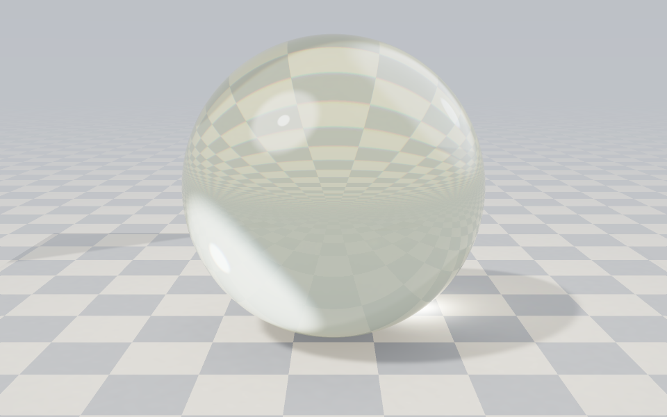
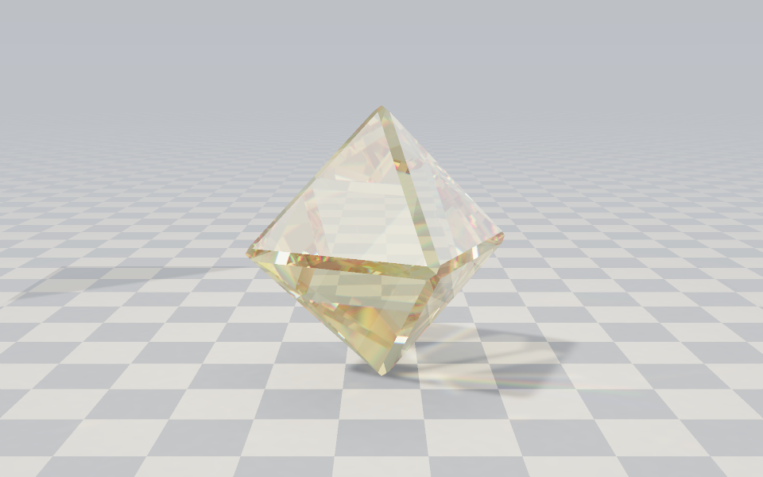
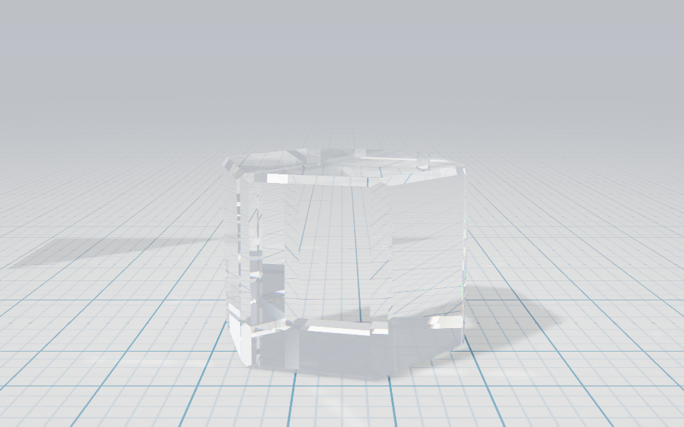
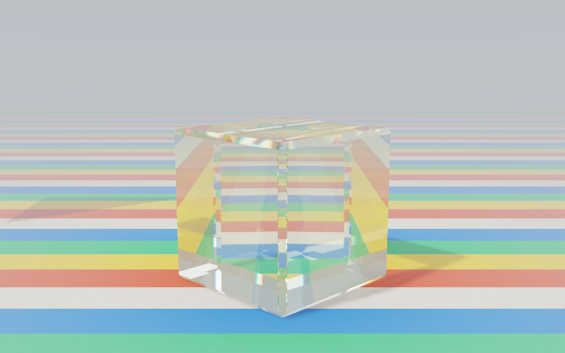

# Caustikon

Real optical glass for design, games, 3D and .NET.

[](https://github.com/levvs-one/caustikon/actions/workflows/verify.yml)
[](LICENSE)
[](DATA-LICENSE.md)

`Caustikon` is the mathematics: vector refraction, exact Fresnel power reflectance, Schlick's
approximation, and dispersion models as allocation-free value types. `Caustikon.Glasses` is a
catalog of 1646 manufacturer glasses from SCHOTT, OHARA, HOYA, CDGM, HIKARI, SUMITA and others, plus nine
liquids (water, ethanol, glycerol, benzene and more) from published measurements, each with its
dispersion fit, tabulated absorption, temperature coefficients where published, and a citation for
every number. Both target .NET 8 and .NET 10 with no dependencies outside the base class library.

The site at <https://caustikon.levvs.cc> runs the same code in the browser.

| | |
| --- | --- |
|  |  |
|  |  |

Every picture above is traced by `tools/Caustikon.Gallery` with the packages' own refraction,
Fresnel split and absorption at nine wavelengths, a photon pass from the lamp for the shadow and
the caustic, and chamfered edges. Nothing in them is painted. The [3D page](https://caustikon.levvs.cc/render)
does the same on the GPU for any catalog glass, with a stochastic spectrum and up to 48 samples per pixel.

## What the site gives you

- [Catalog](https://caustikon.levvs.cc/catalog): every glass on the Abbe diagram and in a filterable table; each glass
  page has its curve, the Fraunhofer lines, reflectance against angle, absorption and the colour of daylight after any
  thickness, temperature coefficients, the model's coefficients and the source of every number.
- [Design](https://caustikon.levvs.cc/design): a panel of a real glass over an interface, traced in a WebGL2 shader
  (bevel and dome refraction per colour channel, Fresnel sheen, tint from the k table), with the shader, CSS and .NET to copy.
- [3D](https://caustikon.levvs.cc/render): a solid of any glass on a table, traced on the GPU; drag to orbit.
- [Optic](https://caustikon.levvs.cc/): an optical bench: white light through any lens, prism, plate or a shape you draw,
  in any medium at any temperature, with the full refraction calculator beneath.
- Give Me!: one page per craft. Pick a glass and a thickness and get the numbers in every format, each value explained:
  [design](https://caustikon.levvs.cc/give/design) (CSS, Tailwind, Figma, GLSL),
  [games](https://caustikon.levvs.cc/give/games) (Unity HDRP, Unreal, Godot 4, HLSL/GLSL),
  [3D and Blender](https://caustikon.levvs.cc/give/blender) (Principled BSDF, glTF, USD),
  [web](https://caustikon.levvs.cc/give/web) (three.js, glTF, CSS) and [.NET](https://caustikon.levvs.cc/give/dotnet).


## Install

```
dotnet add package Caustikon
dotnet add package Caustikon.Glasses
```

## Use

```csharp
using System.Numerics;
using Caustikon;
using Caustikon.Glasses;

// The concrete model is a value type: nothing allocates on the ray path.
Sellmeier bk7 = Schott.NBK7;
bk7.EvaluateNanometers(587.5618, out double nd);          // 1.51680

// A ray at 30° to the normal enters the glass from air.
Vector3 incident = Vector3.Normalize(new Vector3(0.5f, -0.8660254f, 0f));
RefractionKind kind = Dielectric.RefractUnit(incident, Vector3.UnitY, 1f, (float)nd, out Vector3 transmitted);
FresnelPower r = Dielectric.Fresnel(0.8660254f, 1f, (float)nd);   // r.S, r.P, r.Unpolarized

// By name, with everything the catalog knows about the glass.
Glass glass = GlassCatalog.Find("ohara", "S-BSL7")!;
double abbe = glass.AbbeD;                                          // from the fit; glass.CatalogAbbeD is the printed value
glass.Extinction!.InternalTransmittance(400, 10, out double t);     // τi of a 10 mm path at 400 nm
string tint = GlassColour.Transmitted(glass, 25)!.Value.Hex;        // what a 25 mm slab does to D65, as sRGB
```

A caller's own glass has the same standing as a catalogued one:

```csharp
Sellmeier melt = new(0, [1.0396, 0.2318, 1.0105], [0.0060, 0.0200, 103.56], 300, 2500);
Glass mine = Glass.Define("melt 42", in melt, "in-house measurement, 2026-09", new DateOnly(2026, 9, 5));
```

Batch overloads write into caller-owned spans; the rules are in
[the buffer contract](docs/conventions.md#batch-buffer-rules). [CriticalBoundary](examples/CriticalBoundary)
is a complete batch example across a glass-to-air interface, and [Prism](examples/Prism) traces six
wavelengths through an N-BK7 prism with polarized power tracked across both faces.

## API map

| Area | Scalar API | Batch API |
| --- | --- | --- |
| Refraction | `Dielectric.RefractUnit` | Shared or per-lane refractive indices |
| Exact dielectric reflectance | `Dielectric.Fresnel` | Shared or per-lane refractive indices |
| Normal-incidence reflectance | `Dielectric.NormalReflectance` | Per-lane refractive indices |
| Schlick reflectance | `Dielectric.Schlick` | Shared `R0` or shared refractive indices |
| Dispersion, any model | `IDispersionModel.EvaluateNanometers` | `Dispersion.EvaluateNanometers<T>` |
| Sellmeier, up to eight terms | `Sellmeier` | same |
| Power series in `n²` or `n` | `Polynomial`, `Cauchy` | same |
| Fixed three-term forms | `Sellmeier3`, `Cauchy3` | same |
| Catalog lookup | `GlassCatalog.Find`, `GlassCatalog.All`, vendor classes such as `Schott` | — |
| Absorption | `TabulatedExtinction.InternalTransmittance` | — |
| Temperature | `ThermalDispersion.AbsoluteIndexShift` | — |
| Colour | `GlassColour.Transmitted`, `GlassColour.FromTransmittance` | — |

Generic code constrains a model as `where T : struct, IDispersionModel`; the runtime specializes
per model type and nothing boxes. `GlassCatalog` boxes each model once when a glass is resolved
by name, which is why the vendor classes expose the concrete struct for hot paths.

## What is verified

Every catalogued glass is evaluated in CI at the exact d, F and C lines and compared with the
manufacturer's *printed* `nd` and `νd`, which are independent of the fit. The bound is five
units in the fifth decimal of index plus the rounding of the printed value, and the bound on
`νd` follows from that by propagation. `data/glasses/manifest.json` records the deviation of
each fit and names the largest.

N-BK7 is pinned to its SCHOTT datasheet of 1 December 2023: seven internal-transmittance rows
at 10 mm and 25 mm, and nine `dn/dT` values across three temperature ranges and three spectral
lines, each within the datasheet's printed precision. D65 through a perfect transmitter
reproduces the D65 white point. The refraction benchmark reports zero managed allocations in
all sixteen scalar and span cases; [the report](docs/performance.md) has the method and numbers.

## Numerical contracts

[docs/conventions.md](docs/conventions.md) states the direction and index conventions, the
critical-angle tolerance, dispersion statuses and units, batch buffer rules, and constructor
signatures. They are part of the public API.

## Scope

Caustikon models homogeneous, isotropic dielectric media: a real phase index for refraction and
reflection, bulk absorption from tabulated extinction, and the temperature dependence of the
absolute index in the manufacturers' published form. It does not model birefringence,
polarization state beyond s and p power fractions at an interface, thin-film interference,
diffraction, scattering, surface roughness, coatings, the temperature or pressure dependence of
air, lens geometry, ray–scene intersection, or rendering. It is intended to be embedded in
systems that own those concerns.

## Data

The glass catalog is generated from the RefractiveIndex.INFO database, released under CC0 1.0,
by `tools/Caustikon.Glasses.Generator`; the normalized rows and the provenance record of every
glass are committed under `data/glasses/`. Colour uses the CIE 1931 2° observer and illuminant
D65. [DATA-LICENSE.md](DATA-LICENSE.md) has the licences and citations.

## Build and test

```powershell
dotnet restore Caustikon.sln --locked-mode
dotnet build Caustikon.sln -c Release --no-restore
dotnet test --project tests/Caustikon.Tests/Caustikon.Tests.csproj -c Release -f net10.0 --no-build
dotnet test --project tests/Caustikon.Glasses.Tests/Caustikon.Glasses.Tests.csproj -c Release -f net10.0 --no-build
dotnet pack src/Caustikon/Caustikon.csproj -c Release --no-build --output artifacts/package
```

The repository selects .NET SDK 10.0.400 and permits later patches in the same feature band;
running the `net8.0` tests also needs the .NET 8 runtime. The site needs the `wasm-tools`
workload. See [CONTRIBUTING.md](CONTRIBUTING.md) for the acceptance rules used for numerical
changes and benchmarks.

## References

- W. Sellmeier, [Zur Erklarung der abnormen Farbenfolge im Spectrum einiger Substanzen](https://onlinelibrary.wiley.com/doi/10.1002/andp.18722231105), 1872 - the original dispersion relation.
- Christophe Schlick, [An Inexpensive BRDF Model for Physically-based Rendering](https://onlinelibrary.wiley.com/doi/10.1111/1467-8659.1330233), 1994 - the reflectance approximation used by `Dielectric.Schlick`.
- Matt Pharr, Wenzel Jakob, and Greg Humphreys, [Physically Based Rendering, fourth edition - Specular Reflection and Transmission](https://www.pbr-book.org/4ed/Reflection_Models/Specular_Reflection_and_Transmission) - equations and a reference implementation for dielectric reflection and refraction.
- M. N. Polyanskiy, [Refractiveindex.info database of optical constants](https://doi.org/10.1038/s41597-023-02898-2), Scientific Data 11, 94 (2024) - the source of the glass catalog.
- SCHOTT, [N-BK7 optical glass datasheet](https://media.schott.com/api/public/content/41e799d0bf874807a0bb8e702fbb75b5?v=54856406) - the tabulated indices, internal transmittance and temperature coefficients the tests pin N-BK7 to.
- SCHOTT, [TIE-19: Temperature Coefficient of the Refractive Index](https://www.schott.com/en-us/products/optical-glass-p1000267/technical-details) - the form of `ThermalDispersion`.
- CIE 015:2018, Colorimetry - the 1931 2° observer and illuminant D65 used by `GlassColour`.

## License

[MIT](LICENSE) - Copyright (c) 2026 levvs-one. Data licences are listed in [DATA-LICENSE.md](DATA-LICENSE.md).
