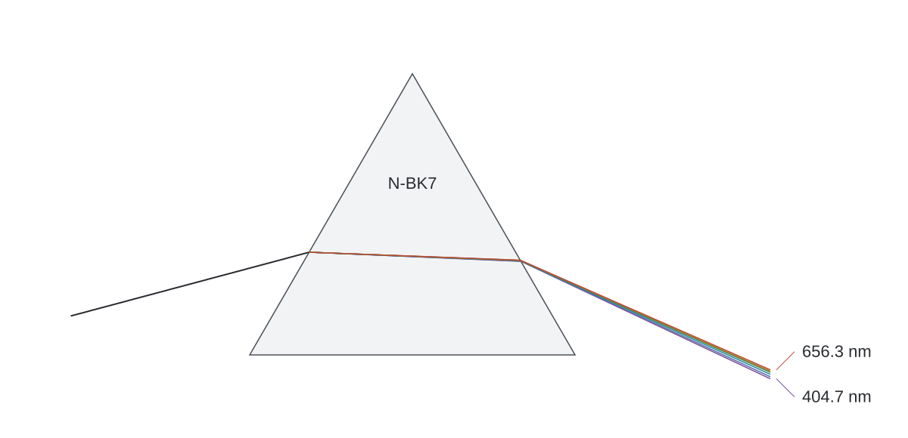

# Prism dispersion

Six coincident rays pass through an equilateral N-BK7 prism. Their paths are calculated with Caustikon, without exaggerating the small spectral spread. The two labels mark the shortest and longest sampled wavelengths; numerical results are printed to the console.



From the repository root, with the .NET 10 SDK:

```sh
dotnet run --project examples/Prism -c Release -- examples/Prism/prism.svg
```

The optional argument is the output file. Its parent directory must already exist. With no argument, the program writes `prism.svg` in the current directory. Running again replaces that generated drawing. Invalid arguments, failed intersections, unsuccessful dispersion/refraction, and output errors return a nonzero exit code.

The console reports the wavelength, refractive index, exit direction, deviation from the incoming ray, and first-pass transmitted power. The input direction is +15 degrees from the horizontal, corresponding to 45 degrees from the entrance-face normal. All angles are in degrees. The prism edge length is one arbitrary geometric unit; scaling it does not change the angles.

With PowerShell 7, check the generated geometry independently of the library:

```powershell
./examples/Prism/verify.ps1 -Path examples/Prism/prism.svg
```

The check reads the SVG coordinates and compares all six internal and exit angles with scalar Snell calculations, within 0.001 degrees. It also checks the prism shape, common entry point and three visible labels. CI runs it on the freshly generated drawing; it does not replace visual inspection.

## Calculation

The three vertices are counterclockwise. Each outward normal is the right-hand perpendicular to its edge. The entry calculation uses that outward normal; the exit calculation reverses it so it points back into the glass. Ray/segment intersections select the nearest positive boundary crossing, excluding the face just crossed.

`Sellmeier3` evaluates the refractive index at each sampled wavelength: 404.7, 435.8, 486.1, 546.1, 587.6 and 656.3 nm. `Dielectric.RefractUnit` computes both interface directions. The example requires ordinary refraction at both surfaces and stops if it encounters a critical angle, total internal reflection, or invalid input. It also checks the independent prism identity `deviation = incidence + emergence - apex` against the vector result.

`Dielectric.Fresnel` supplies the two power reflectances at each interface. The transmitted fraction for initially unpolarized light is

```text
0.5 * ((1 - Rs_entry) * (1 - Rs_exit) + (1 - Rp_entry) * (1 - Rp_exit))
```

The interfaces are coplanar, so their S/P bases remain aligned. Averaging each interface's reflectance first and multiplying the averages would discard the polarization introduced at entry.

## Material and limits

The coefficients come from the [official SCHOTT N-BK7 datasheet](https://media.schott.com/api/public/content/41e799d0bf874807a0bb8e702fbb75b5?v=54856406), dated 01-Dec-2023: `B = [1.039612120, 0.231792344, 1.010469450]`, `C = [0.006000699, 0.0200179144, 103.56065300]` in square micrometers. This example restricts evaluation to 365-2325.4 nm and samples only visible catalog wavelengths. SCHOTT's relative indices use air as their reference; the surrounding medium is therefore represented by index 1.

The model is homogeneous, isotropic and lossless, with flat uncoated interfaces. First-pass power excludes bulk absorption and secondary reflected paths. There is no temperature correction, diffraction, finite beam width or sensor response. The line colors are illustrative labels, not a wavelength-to-display-color conversion; their brightness does not encode power. The source and exit segments have finite drawing lengths, not finite physical propagation ranges.

SVG is written with the .NET XML library. No external packages, network access, graphics runtime or renderer are needed to run the example.
